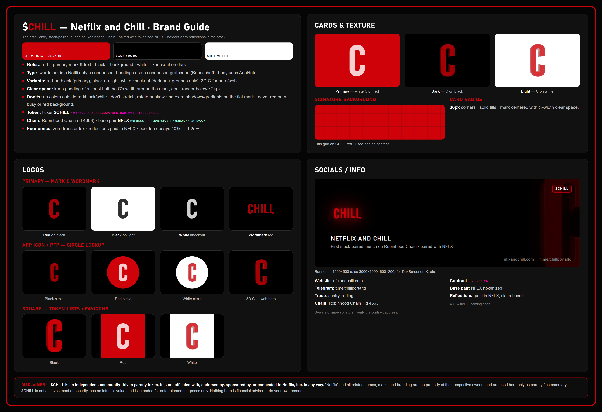

# $CHILL — Netflix and Chill · Brand Kit

Official brand assets for **$CHILL** — the first Sentry stock-paired launch on
Robinhood Chain, paired with tokenized NFLX, paying holders reflections in the
stock.



> 📈 **[Daily $CHILL Shareholder Report →](daily-holder-report/)** — our progress
> toward acquiring a controlling interest in NFLX, updated automatically every day.

## Palette

| Role | Color | Hex | RGB |
|---|---|---|---|
| Primary / mark & text | Red | `#CF020A` | 207, 2, 10 |
| Background | Black | `#000000` | 0, 0, 0 |
| Knockout | White | `#FFFFFF` | 255, 255, 255 |

## Contents

```
logos/
  primary/      C mark + CHILL wordmark — red / black / white-knockout (transparent)
  icons/        circle app-icon / PFP lockups — C and CHILL, black / red / white
  square/       C icon + wordmark on solid black / red / white backgrounds
  3D-c-for-website.png   glossy 3D C hero (transparent)
Socials/
  banners/      1500×500, 3000×1000, 600×200
  logos/        token logo 1024×1024, 100×100
Misc/
  cards/        primary / dark / light — C and CHILL versions (transparent corners)
  signature-background-house-texture.png
brand-guide/    full brand guide poster (solid + transparent background)
DISCLAIMER.md   legal disclaimer text for site footer / socials
```

## Usage rules

- Colors: red / black / white only — don't recolor outside the palette.
- Don't stretch, rotate, or skew the mark; no extra shadows or gradients on the flat mark.
- White knockout is for dark backgrounds only; never place red on a busy or red background.
- Clear space: keep padding of at least half the C's width around the mark; don't render below ~24px.

## Links

- **Website:** https://nflxandchill.com
- **Telegram:** https://t.me/chillportaltg
- **Trade:** create an account at sentry.trading — or trade with no account at sentry.trading/swap
- **Chain:** Robinhood Chain (id 4663)
- **Contract:** `0xF699AEA8a333202A7Dc610aBc664c213c9dc4111`
- **Base pair:** NFLX (tokenized) `0xE0444EF8BF4eD74f74FD73686e2ddF4C1c5591E8`

## Disclaimer

**$CHILL is an independent, community-driven parody token. It is not affiliated
with, endorsed by, sponsored by, or connected to Netflix, Inc. in any way.**
"Netflix" and all related marks are the property of their respective owners.
$CHILL is not an investment or security and is for entertainment purposes only.
See [DISCLAIMER.md](DISCLAIMER.md) for full text.
