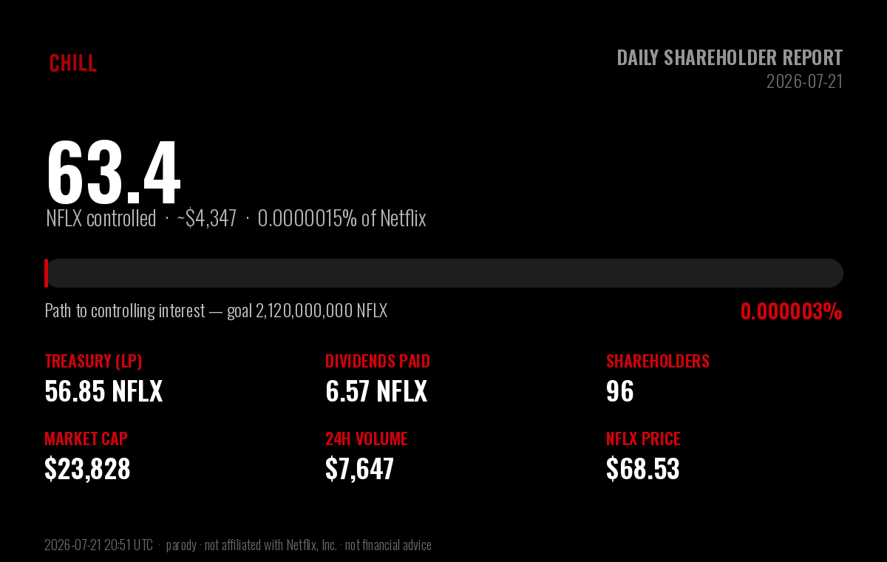

# $CHILL — Daily Shareholder Report

### Netflix and Chill · Report to Shareholders · 2026-07-21

> **Corporate objective:** acquire a controlling interest in Netflix (NFLX).
> Netflix has **4,220,000,000** shares outstanding; a majority
> stake requires **2,120,000,000 NFLX**. $CHILL accumulates NFLX two ways — NFLX held
> in protocol-owned liquidity, and reflections distributed to shareholders.

## Ownership position

| Metric | Value |
|---|---|
| **NFLX under $CHILL control** | **63.43 NFLX** (~$4,347) |
| Stake in Netflix | 0.000001503% of shares outstanding |
| Progress to controlling interest | 0.0000030% of 2,120,000,000 |
| Shares remaining to majority | 2,119,999,937 NFLX |

## Balance sheet — NFLX holdings

| Holding | NFLX | USD |
|---|---|---|
| Treasury (protocol-owned liquidity) | 56.85 | $3,896 |
| Dividends distributed to shareholders | 6.57 | $451 |
| **Total NFLX controlled** | **63.43** | **$4,347** |

## Last 24 hours

| Metric | Value |
|---|---|
| Trading volume | 111.59 NFLX (~$7,647) |
| Net NFLX accumulated | -13.91 NFLX |
| Dividends generated | 1.1159 NFLX |
| Transactions | 98 (64 buys / 34 sells) |
| $CHILL price change | -1.2% |

## Shareholder & market data

| Metric | Value |
|---|---|
| Shareholders of record | 96 |
| Lifetime unique participants | 201 |
| Shares outstanding ($CHILL) | 1,000,000,000 |
| Market capitalization | $23,828 |
| $CHILL price | $0.00002383 |
| NFLX price | $68.53 |
| Lifetime volume | 657.45 NFLX (~$45,056) |
| Lifetime transactions | 711 (470 buys / 241 sells) |
| Days since IPO (launch) | 2 |

## Per-share metrics

| Metric | Value |
|---|---|
| NFLX backing per 1M $CHILL | 0.063426 NFLX |
| Dividends per 1M $CHILL | 0.006574 NFLX |

---

*Report generated 2026-07-21 20:51 UTC · block 15,864,120 · data via the Sentry-Robinhood
subgraph and Robinhood Chain explorer.*

**Disclaimer:** $CHILL is an independent, community-driven **parody** token. It is
**not affiliated with, endorsed by, sponsored by, or connected to Netflix, Inc.**
in any way. This "shareholder report" is satire. $CHILL is not a security, equity,
or claim on Netflix; it does not represent real ownership of Netflix and confers no
shareholder rights. For entertainment only — not financial advice. DYOR.
