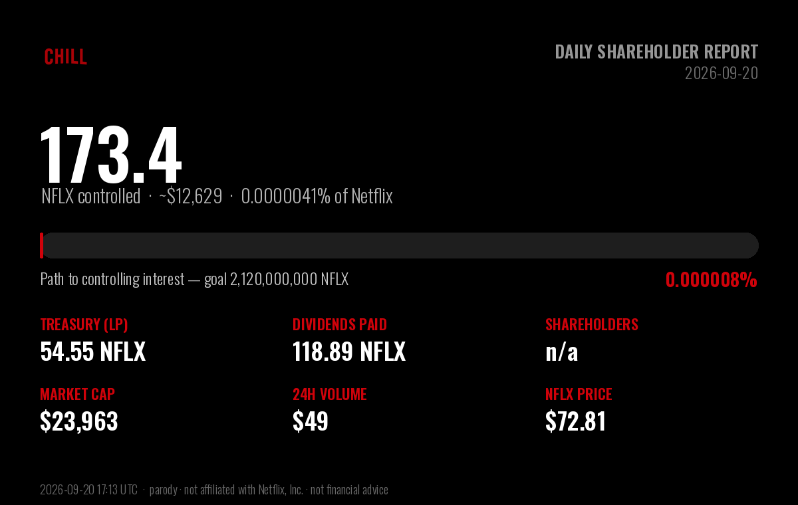

# $CHILL — Daily Shareholder Report

### Netflix and Chill · Report to Shareholders · 2026-08-05

> **Corporate objective:** acquire a controlling interest in Netflix (NFLX).
> Netflix has **4,220,000,000** shares outstanding; a majority
> stake requires **2,120,000,000 NFLX**. $CHILL accumulates NFLX two ways — NFLX held
> in protocol-owned liquidity, and reflections distributed to shareholders.

## Ownership position

| Metric | Value |
|---|---|
| **NFLX under $CHILL control** | **96.56 NFLX** (~$7,112) |
| Stake in Netflix | 0.000002288% of shares outstanding |
| Progress to controlling interest | 0.0000046% of 2,120,000,000 |
| Shares remaining to majority | 2,119,999,903 NFLX |

## Balance sheet — NFLX holdings

| Holding | NFLX | USD |
|---|---|---|
| Treasury (protocol-owned liquidity) | 73.61 | $5,421 |
| Dividends distributed to shareholders | 22.95 | $1,691 |
| **Total NFLX controlled** | **96.56** | **$7,112** |

## Last 24 hours

| Metric | Value |
|---|---|
| Trading volume | 188.31 NFLX (~$13,869) |
| Net NFLX accumulated | 11.59 NFLX |
| Dividends generated | 1.8831 NFLX |
| Transactions | 185 (101 buys / 84 sells) |
| $CHILL price change | +83.6% |

## Shareholder & market data

| Metric | Value |
|---|---|
| Shareholders of record | 162 |
| Lifetime unique participants | 659 |
| Shares outstanding ($CHILL) | 1,000,000,000 |
| Market capitalization | $40,820 |
| $CHILL price | $0.00004082 |
| NFLX price | $73.65 |
| Lifetime volume | 2,295.42 NFLX (~$169,058) |
| Lifetime transactions | 3,312 (1,904 buys / 1,408 sells) |
| Days since IPO (launch) | 16 |

## Per-share metrics

| Metric | Value |
|---|---|
| NFLX backing per 1M $CHILL | 0.096560 NFLX |
| Dividends per 1M $CHILL | 0.022954 NFLX |

---

*Report generated 2026-08-05 15:58 UTC · block 28,611,711 · data via the Sentry-Robinhood
subgraph and Robinhood Chain explorer.*

**Disclaimer:** $CHILL is an independent, community-driven **parody** token. It is
**not affiliated with, endorsed by, sponsored by, or connected to Netflix, Inc.**
in any way. This "shareholder report" is satire. $CHILL is not a security, equity,
or claim on Netflix; it does not represent real ownership of Netflix and confers no
shareholder rights. For entertainment only — not financial advice. DYOR.
