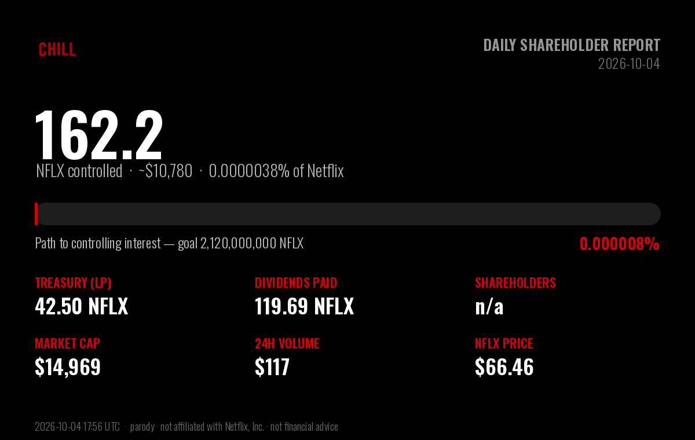

# $CHILL — Daily Shareholder Report

### Netflix and Chill · Report to Shareholders · 2026-10-10

> **Corporate objective:** acquire a controlling interest in Netflix (NFLX).
> Netflix has **4,220,000,000** shares outstanding; a majority
> stake requires **2,120,000,000 NFLX**. $CHILL accumulates NFLX two ways — NFLX held
> in protocol-owned liquidity, and reflections distributed to shareholders.

## Ownership position

| Metric | Value |
|---|---|
| **NFLX under $CHILL control** | **162.08 NFLX** (~$11,626) |
| Stake in Netflix | 0.000003841% of shares outstanding |
| Progress to controlling interest | 0.0000076% of 2,120,000,000 |
| Shares remaining to majority | 2,119,999,838 NFLX |

## Balance sheet — NFLX holdings

| Holding | NFLX | USD |
|---|---|---|
| Treasury (protocol-owned liquidity) | 42.30 | $3,034 |
| Dividends distributed to shareholders | 119.79 | $8,592 |
| **Total NFLX controlled** | **162.08** | **$11,626** |

## Last 24 hours

| Metric | Value |
|---|---|
| Trading volume | 0.00 NFLX (~$0) |
| Net NFLX accumulated | 0.00 NFLX |
| Dividends generated | 0.0000 NFLX |
| Transactions | 0 (0 buys / 0 sells) |
| $CHILL price change | +3.4% |

## Shareholder & market data

| Metric | Value |
|---|---|
| Shareholders of record | n/a |
| Lifetime unique participants | 1819 |
| Shares outstanding ($CHILL) | 1,000,000,000 |
| Market capitalization | $15,818 |
| $CHILL price | $0.00001582 |
| NFLX price | $71.73 |
| Lifetime volume | 11,978.63 NFLX (~$859,231) |
| Lifetime transactions | 8,609 (4,813 buys / 3,796 sells) |
| Days since IPO (launch) | 83 |

## Per-share metrics

| Metric | Value |
|---|---|
| NFLX backing per 1M $CHILL | 0.162084 NFLX |
| Dividends per 1M $CHILL | 0.119786 NFLX |

---

*Report generated 2026-10-10 18:10 UTC · block 85,198,002 · data via the Sentry-Robinhood
subgraph and Robinhood Chain explorer.*

**Disclaimer:** $CHILL is an independent, community-driven **parody** token. It is
**not affiliated with, endorsed by, sponsored by, or connected to Netflix, Inc.**
in any way. This "shareholder report" is satire. $CHILL is not a security, equity,
or claim on Netflix; it does not represent real ownership of Netflix and confers no
shareholder rights. For entertainment only — not financial advice. DYOR.
