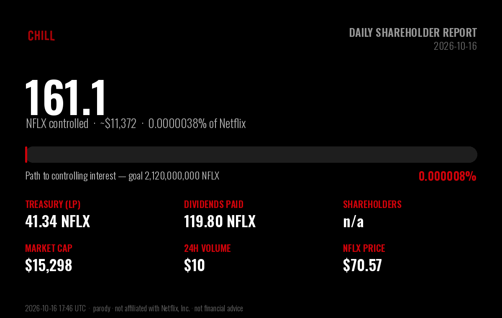

# $CHILL — Daily Shareholder Report

### Netflix and Chill · Report to Shareholders · 2026-10-26

> **Corporate objective:** acquire a controlling interest in Netflix (NFLX).
> Netflix has **4,220,000,000** shares outstanding; a majority
> stake requires **2,120,000,000 NFLX**. $CHILL accumulates NFLX two ways — NFLX held
> in protocol-owned liquidity, and reflections distributed to shareholders.

## Ownership position

| Metric | Value |
|---|---|
| **NFLX under $CHILL control** | **158.48 NFLX** (~$10,054) |
| Stake in Netflix | 0.000003756% of shares outstanding |
| Progress to controlling interest | 0.0000075% of 2,120,000,000 |
| Shares remaining to majority | 2,119,999,842 NFLX |

## Balance sheet — NFLX holdings

| Holding | NFLX | USD |
|---|---|---|
| Treasury (protocol-owned liquidity) | 38.65 | $2,452 |
| Dividends distributed to shareholders | 119.83 | $7,602 |
| **Total NFLX controlled** | **158.48** | **$10,054** |

## Last 24 hours

| Metric | Value |
|---|---|
| Trading volume | 0.00 NFLX (~$0) |
| Net NFLX accumulated | 0.00 NFLX |
| Dividends generated | 0.0000 NFLX |
| Transactions | 0 (0 buys / 0 sells) |
| $CHILL price change | +2.0% |

## Shareholder & market data

| Metric | Value |
|---|---|
| Shareholders of record | n/a |
| Lifetime unique participants | 1821 |
| Shares outstanding ($CHILL) | 1,000,000,000 |
| Market capitalization | $13,088 |
| $CHILL price | $0.00001309 |
| NFLX price | $63.44 |
| Lifetime volume | 11,982.92 NFLX (~$760,195) |
| Lifetime transactions | 8,623 (4,818 buys / 3,805 sells) |
| Days since IPO (launch) | 99 |

## Per-share metrics

| Metric | Value |
|---|---|
| NFLX backing per 1M $CHILL | 0.158483 NFLX |
| Dividends per 1M $CHILL | 0.119829 NFLX |

---

*Report generated 2026-10-26 19:41 UTC · block 98,666,166 · data via the Sentry-Robinhood
subgraph and Robinhood Chain explorer.*

**Disclaimer:** $CHILL is an independent, community-driven **parody** token. It is
**not affiliated with, endorsed by, sponsored by, or connected to Netflix, Inc.**
in any way. This "shareholder report" is satire. $CHILL is not a security, equity,
or claim on Netflix; it does not represent real ownership of Netflix and confers no
shareholder rights. For entertainment only — not financial advice. DYOR.
